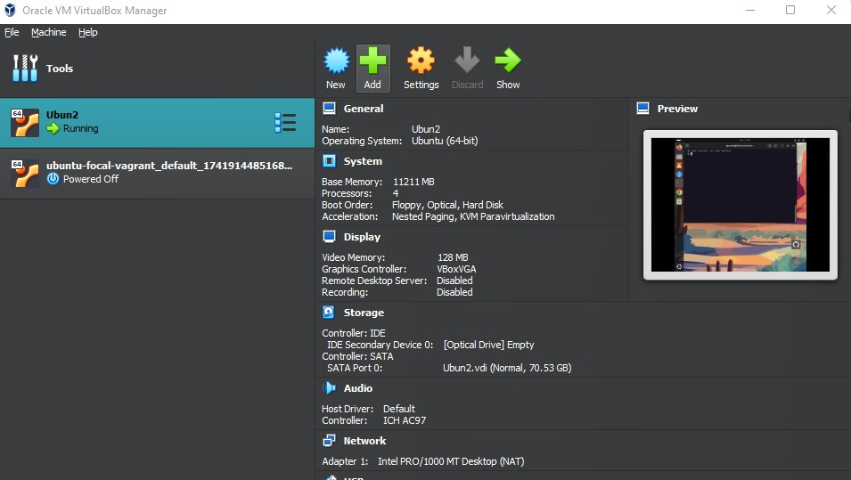

# Ubuntu Server Installation & Configuration Guide

This is a personalized documentation of how I installed and configured Ubuntu Server in a VirtualBox environment, customized my terminal using `oh-my-zsh`. This guide includes screenshots (to be added in GitHub) and is structured to help others replicate the same process.

---

## 1. Prerequisites

- **Virtualization software**: [VirtualBox](https://www.virtualbox.org/)
- **Ubuntu Server ISO**: [Ubuntu Server Downloads](https://ubuntu.com/download/server)
- A stable internet connection


---

## 2. Creating the Virtual Machine

1. Open VirtualBox and click **New**.
2. Name the VM (e.g., `UbuntuServer`), set **Type** to "Linux", and **Version** to "Ubuntu (64-bit)".
3. Allocate RAM (I used 11211 MB).
4. Create a virtual hard disk (I used 70GB).
5. Go to **Settings > Storage**, attach the Ubuntu Server ISO under Controller: IDE. 

 "

---

## 3. Ubuntu Server Installation Steps

1. Start the virtual machine.
2. Select language and keyboard layout.
3. Configure the network (I used DHCP).
4. Set up a username and a secure password.
5. Use the entire disk with LVM.
6. Skip Snap packages.
7. Reboot and remove ISO from VM settings.


---

## 4. Post-Installation Configuration

### 4.1 Update and Install Essentials

```bash
sudo apt update && sudo apt upgrade -y
sudo apt install git curl wget -y

## 5.1 Install Zsh

```bash
sudo apt install zsh -y
```

## 5.2 Install Oh-My-Zsh

```bash
sh -c "$(curl -fsSL https://raw.githubusercontent.com/ohmyzsh/ohmyzsh/master/tools/install.sh)"
```

## 5.3 Set Zsh as Default Shell

```bash
chsh -s $(which zsh)
```

```text
Note: Log out and log back in for the shell change to take effect.
```

## 6. Essential System Configuration

This section documents the basic system settings I configured after installing linux on my machine. These steps were essential to get my machine properly connected, named, and securely managed by users and groups.

---


### 6.2 Set Hostname

I wanted my server to have a unique hostname for identification on the network, so I set it with:

```bash
sudo hostnamectl set-hostname hicit-local-server
```

Then I updated `/etc/hosts` to reflect the change:

```bash
sudo nano /etc/hosts
```

I made sure the file included the line:

```
127.0.1.1    hicit-local-server
```

---

### 6.3 User and Group Management

#### Add a New User

I created a new user so I wouldn’t be using the root account for daily tasks:

```bash
sudo adduser montane
```

#### Grant Sudo Privileges

To give this new user administrative rights:

```bash
sudo usermod -aG sudo montane
```

#### Create a New Group

For better access control, I created a group for development purposes:

```bash
sudo groupadd devteam
```

#### Add User to the Group

I added my new user to the group:

```bash
sudo usermod -aG devteam montane
```

#### View User’s Groups

To confirm group membership:

```bash
groups montane
```

#### (Optional) Delete a User or Group

If needed in the future:

```bash
sudo deluser username
sudo delgroup groupname
```

This completed my initial system setup. With networking, hostname, and permissions properly configured, my Ubuntu Server was ready for further installations.
